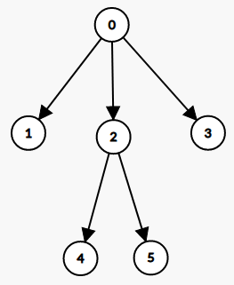

## Description
Implement BFS and DFS algorithm to traverse a directed graph. Create a program in C++ that accepts the following input:
- The first line contains an integer *N* that represents the number of nodes in the graph. The node's name will be an integer from 0 to N-1.
- The second line contains an integer *M* that represents the number of edges in the graph.
- *M* lines follow - Each line contains two integer *a* and *b* that represents a directed edge from *a* to *b*.
- The next line contains an integer that represents the starting node.
- The last line is the traversal algorithm that will be used (BFS/DFS).

The program then outputs the traversal order.

### Example
#### Graph

#### Example 1
Input
```
6
5
0 1
0 2
0 3
2 4
2 5
0
DFS
```
Output
```
0 1 2 4 5 3
```
#### Example 2
Input
```
6
5
0 1
0 2
0 3
2 4
2 5
2
BFS
```
Output
```
2 4 5
```